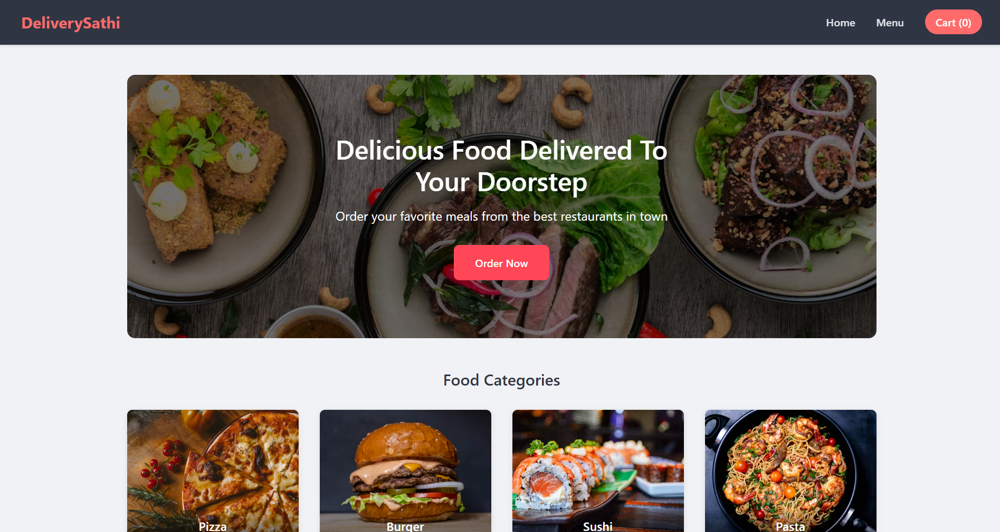
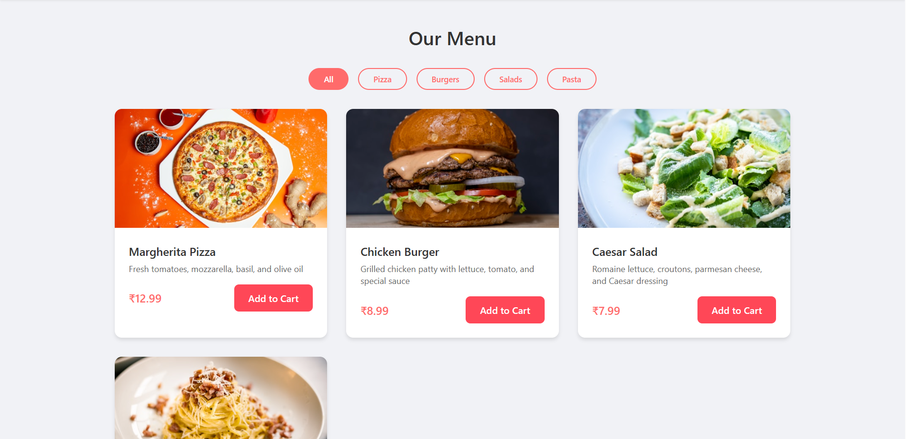
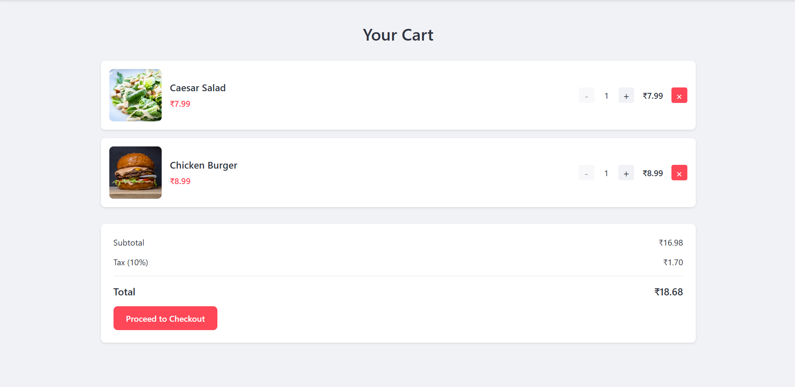
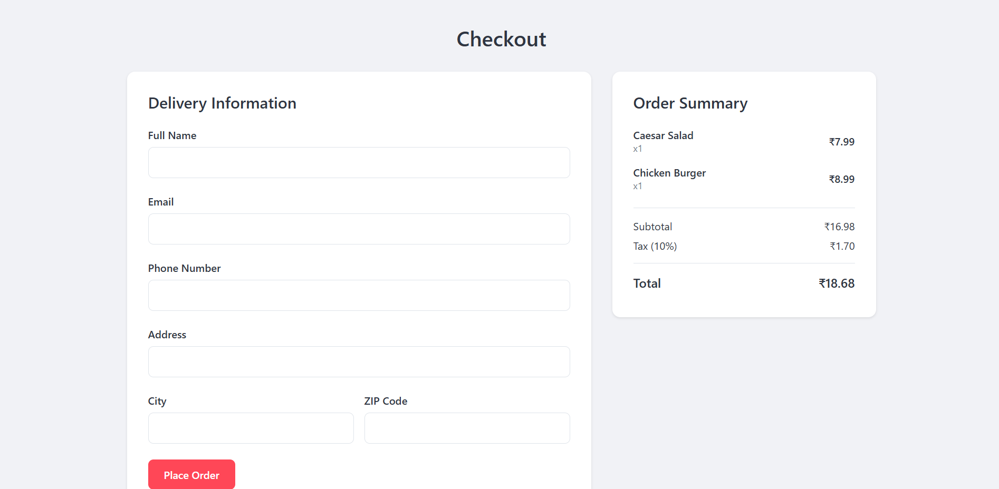

# Food Delivery App

A modern and responsive food delivery application built with React.js and TypeScript. This application allows users to browse a restaurant's menu, add items to their cart, and place orders for delivery.

## Features

- 🏠 Home page with featured items and food categories
- 📋 Menu page with category filtering
- 🛒 Shopping cart with quantity management
- 💳 Checkout process with delivery information form
- 📱 Responsive design for mobile and desktop
- 🎨 Modern and clean UI with smooth animations

## Tech Stack

- React.js
- TypeScript
- React Router for navigation
- CSS Modules for styling
- Modern JavaScript (ES6+)

## Getting Started

### Prerequisites

- Node.js (v14 or higher)
- npm (v6 or higher)

The application will be available at `http://localhost:3000`.

## Project Structure

```
src/
  ├── components/         # Reusable components
  │   ├── Button/
  │   ├── FoodCard/
  │   └── Navbar/
  ├── pages/             # Page components
  │   ├── Home/
  │   ├── Menu/
  │   ├── Cart/
  │   └── Checkout/
  ├── App.tsx            # Main App component
  └── index.tsx          # Entry point
```

## Features Implemented

1. **Home Page**
   - Banner section with call-to-action
   - Food categories display
   - Featured items section

2. **Menu Page**
   - Grid view of food items
   - Category filtering
   - Add to cart functionality

3. **Cart Page**
   - List of added items
   - Quantity adjustment
   - Price calculation
   - Remove items
   - Proceed to checkout

4. **Checkout Page**
   - Delivery information form
   - Order summary
   - Total price calculation

## Future Improvements

- Add user authentication
- Implement real payment processing
- Add order tracking
- Implement search functionality
- Add user reviews and ratings
- Implement dark mode

## Screenshots

Here are some screenshots of the application:

### Home Page


### Menu Page


### Cart Page


### Checkout Page


## License

This project is licensed under the MIT License - see the LICENSE file for details.
